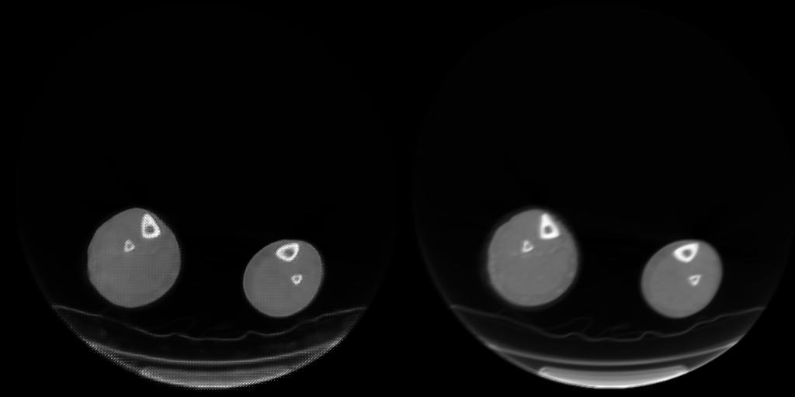

# MSKCC-Medical_Images
MSKCC_program

## Dataset:

Confidential. 

Contact: Yilin Lyu (yl3832@columbia.edu)

## Deblur customized images:

Save the images you want to deblur in a [`images/own`] folder.

```
python main.py --customized=1 --is_train=0 --model_name=./model/your_model_name
```

## Train a GAN model:
```
python main.py 
```

## Test model and evaluation 
```
python main.py --is_train=0 --testing_image=-1 --model_name=./model/your_model_name
```

## Pre-trained model
Model has been trained on the 14,329 pairs of sharp-blurry CT images. 

Instructions about the trained model: [`model/model_log.txt`](model)

Get the model: [Google Drive](https://drive.google.com/drive/folders/1kkcD8GRtkKO720eh9nFNFHD4UBb0vBBG?usp=sharing).

Note that you need to log in your **LionMail@Columbia** to get access to the models.

Contact: Yilin Lyu (yl3832@columbia.edu)

The directory name of models should be `model`.

## Example of Result
From left to right: Sharp, blurred, deblurred



See examples in [`examples`](deblur_generate).
